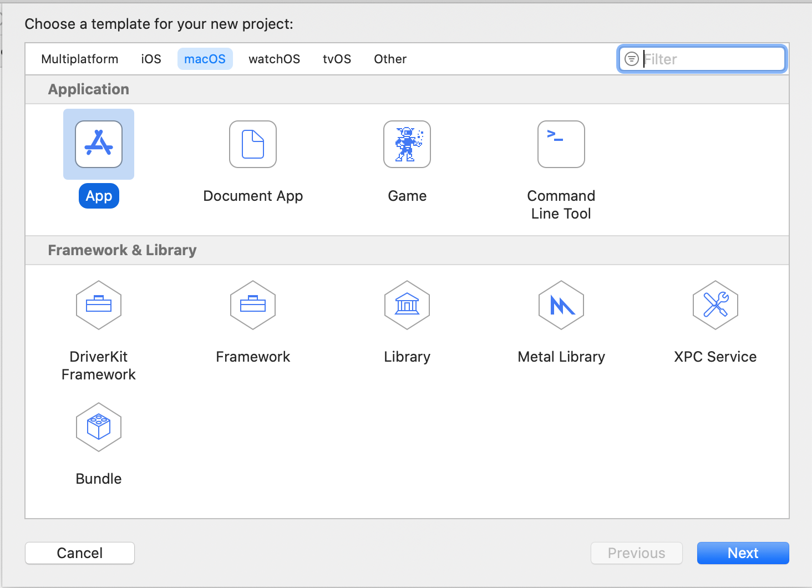
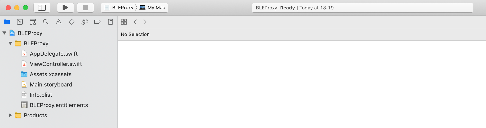
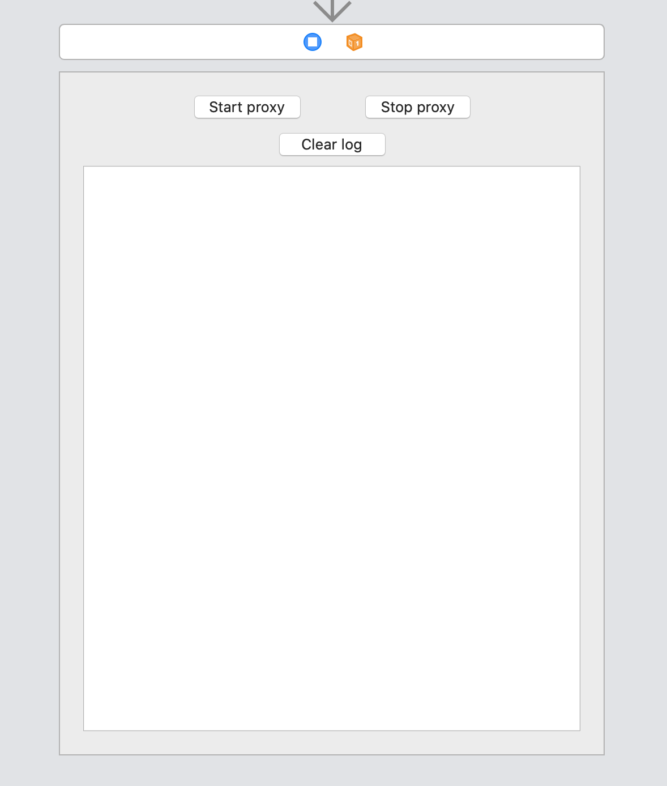

# Bluetooth Low Energy logging by placing a Mac-in-the-middle
## Why?
In the past two years or so I have been delving into Bluetooth Low Energy (BLE) for a project I did for one of our customers at Luminis Arnhem. In this project we have been tasked with implementing mobile applications for Android and iOS that used BLE to communicate with various products made by our customer. Because of this, a lot of my focus has gone to the BLE stacks that Apple and Google have created on their platforms for application developers to use. These stacks take care of the lower levels of the BLE protocol for developers and in very many ways this is a good thing. I don't know if it is even possible, without first having to hack your own device, to completely create your own BLE stack for these platforms on use that on iOS and Android devices instead but I certainly would not recommend you to try it.

On issue with using these stacks however, is that they make it hard as a developer to know what is actually being communicated at the protocol level. The API's that are offered are pretty high level so that they are easy to use, which is good. However the documentation provided with the API's, at least the documentation I have been able to find, is not very descriptive or transparant about how calling those API's translates to actual communication in the BLE protocol. So when your connection does not act as you expected it would and chances are that it will, what you really want to do is take a look at the packets that are actually being transferred and their contents.

## What's Mac got to do with it?
Depending on the platform that your developing for there may already be options available that you can use to get access to such logging without having to put in a lot of effort. For iOS devices with an OS version higher than 13 for example, [Apple already offers a solution](https://www.bluetooth.com/blog/a-new-way-to-debug-iosbluetooth-applications/) using PacketLogger that is fairly easy to set up. I have not actually tried this solution myself yet, but as the solution I am about to propose builds on some of the same concepts I can say with some confidence that this will work. In fact if iOS is the only target you are focussed on I would probably advise you to use this and skip my solution (Keep readin though! It never hurts to learn).

If you are also targetting Android, the challenge becomes a lot bigger. If you google `logging ble on android` you will find plenty of blogs that explain your how to enable [Bluetooth HCI snoop logging](https://source.android.com/devices/bluetooth/verifying_debugging#debugging-with-bug-reports) to achieve this, however I have a few problems with this. First of all the procedure requires a couple of manual steps on the device that you want to log which arent always clear. The official Android documentation and most blogs seem to agree on changing two settings and power cycling your Bluetooth connection (turn Bluetooth off and then on again), however I have also read blogs that insisted you needed to reboot your whole device to make it work. The location on your device where the logs are stored also tends to differ. It could be that these problems are caused by by different Android OS versions or Android devices. The second issue that I have with this solution is that it simply logs everything your device does over Bluetooth to a file and leaves you with the task of figuring out where that one bit of communication your were actually interested in went. There is no option to view the logs during the connection and any filtering that you may want to do on the traffic completely relies on you to find a tool or way to do that. All in all capturing relevant BLE traffic using this method is a exercise in patience I have yet to succeed at.

Another option you could consider is to get what is called a packet sniffer, one that supports BLE. Packet sniffers are devices that allow you to listen in on traffic. Usually you can plug them into your computer and they come with software that allow you to view the traffic and filter it. The problem with this option is that there are actually two types of such devices for BLE, singleband and multiband sniffers. You can buy a singleband packet sniffer for around 50 euros which is afforable enough, but these do not really work well for our purposes. A connection between two devices over Bluetooth Low Energy tends to jump between bands multiple times during the connection. As singleband sniffers by their design are only able to listen in on one band at a time you will find it difficult if not impossible to capture a complete connection. Multiband packet sniffers on the other are able to listen in on multiple bands at the same time and should therefore not have these difficulties. Multiband packet sniffers however are a lot harder to come by and when you do find them they can easily cost ten times as much as a singleband sniffer.

So the Mac then? Earlier when talking about logging BLE traffic for iOS I already mentioned PacketLogger. PacketLogger is a tool that comes with the [Additional Tools for XCode](https://developer.apple.com/download/more/?=xcode). It allows you to view a live log of all the Bluetooth traffic going to and from your Macbook. Various BLE protocol layers and message types are colored differently to easily detect certain messages and you can also filter the traffic in a few ways and save log files to view them later on. It is a great tool and I have used it a lot to analyse problems in BLE connections. But PacketLogger can only log traffic to and from your Mac, how will this help us log traffic between our application and another device? Well XCode allows you to create applications that run on your Mac and using CoreBluetooth, the BLE stack that Apple has created for iOS and MacOS applications, it is not that hard to create a small application that acts as a proxy between the Peripheral and Central in your BLE connection, provided you know some basic information about the Peripheral you want to use this on. The information you need to know is:
- The name the Peripheral advertises with.
- The password for the Peripheral, if it uses a secure BLE connection.
- The Services offered by the Peripheral, or at least the ones that you wish to use in your app.
- The Characteristics on the Services offered by the Peripheral and the types of access they allow. Once again you would at least need to know about the ones you wish to use in your app.

If you plan on developing an application that communicates with your Peripheral then you will probably have all of this information already.

## Let's get started
### Project setup
The first step is to create a new MacOS App project.



After going through the new project Wizard you should have something like this:



### Building the UI
This application does not need much of a UI, but its useful to have some. I bet we could use:
- A button to start the proxy
- A button to stop the proxy
- Some textfield where we can output useful logging
- A button to clear the logs

So let's open up the Main.storyboard of our project and add these components so that it looks like this:



Next connect the IBActions and IBOutlets for the views you added so that you get the following in the `ViewController` class.

```swift
import Cocoa

class ViewController: NSViewController {
    
    @IBOutlet weak var startProxyButton: NSButton!
    @IBOutlet weak var stopProxyButton: NSButton!
    @IBOutlet weak var logView: NSTextField!
    
    override func viewDidLoad() {
        super.viewDidLoad()

        // Do any additional setup after loading the view.
    }

    override var representedObject: Any? {
        didSet {
        // Update the view, if already loaded.
        }
    }

    @IBAction func startProxy(_ sender: Any) {
    }
    
    @IBAction func stopProxy(_ sender: Any) {
    }
    
    @IBAction func clearLog(_ sender: Any) {
    }
}

```

### Creating the BLECentral
Now that we have the project setup and UI done, the next thing we need is to create the Central that will connect to your Peripheral device.